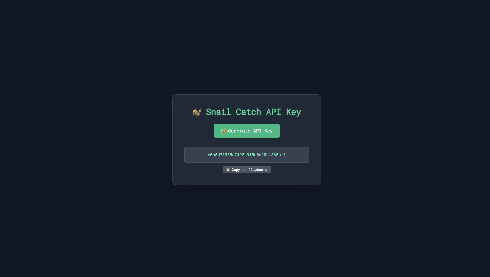
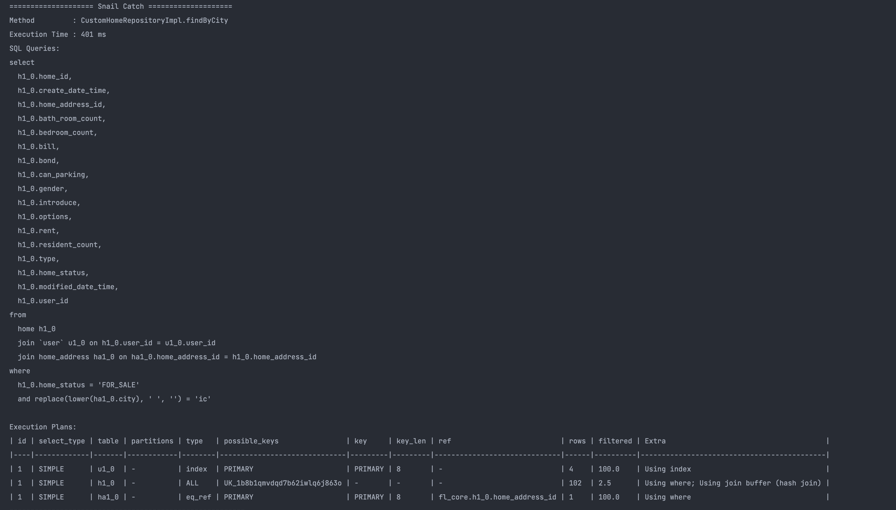
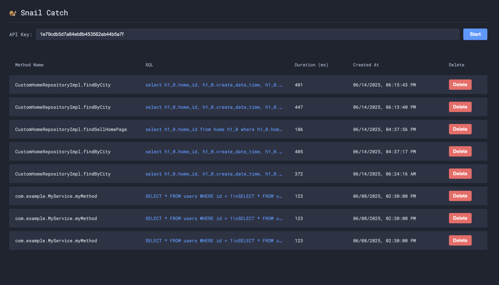
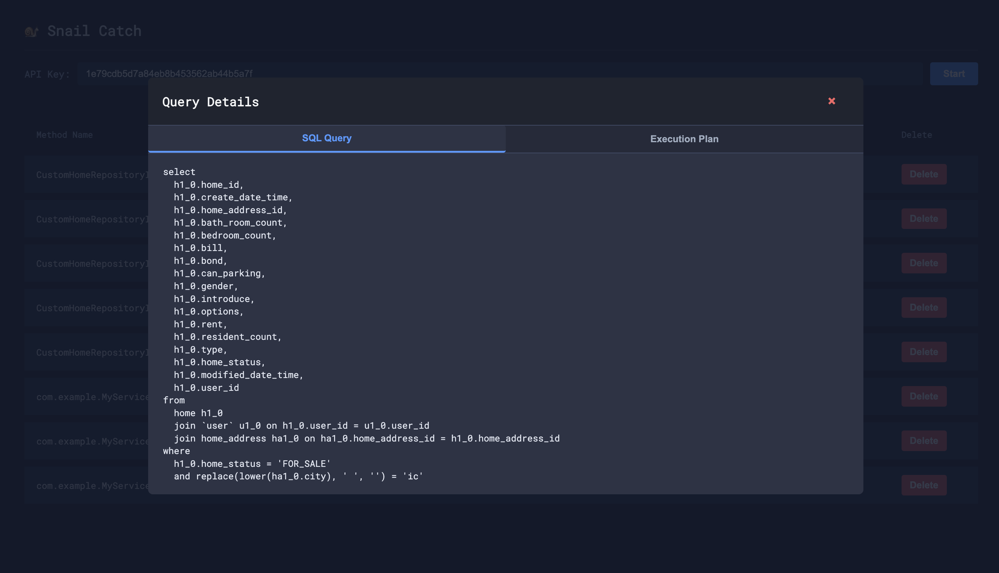
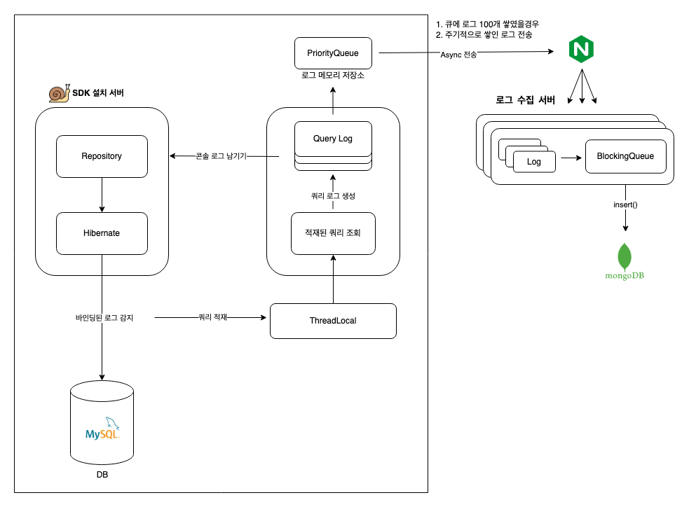

<!-- logo -->
## 🐌 Snail Catch 

--- 

Hibernate 에서 발생하는 SQL 쿼리를 감지해 실행 계획, 메서드 실행 시간, 바인딩된 SQL 쿼리 등을 하나의 객체로 수집해
콘솔 출력 및 수집된 쿼리를 모니터링할 수 있는 웹 페이지를 제공해주는 SDK 서비스 입니다.

SDK 사용 방법 : https://github.com/sinminseok/snail-catch  
Jitpack : https://jitpack.io/#sinminseok/snail-catch (1.0.0 부터 사용 가능)

### 제공 기능  

---

1. 사용자 식별을 위한 REST API KEY 를 발급해드립니다.  

2. SDK 설치 후 자동으로 쿼리 튜닝에 필요한 정보들을 수집 후 보여줍니다.

3. 수집된 쿼리 로그들을 편리하게 보여줍니다.

### 시스템 아키텍처  

----

### 쿼리 수집 방법  

---

**1. Snail Catch SDK를 설치한 사용자로부터 한 번에 최대 100개의 쿼리 로그를 전달받습니다.** 

전달된 로그는 SDK 내부에서 배치 처리용으로 사용되며, 실시간 DB 저장이 아닌 메모리 적재 방식으로 처리됩니다.

**2. 전달받은 로그는 내부 메모리(LinkedBlockingQueue)에 적재됩니다.**

이 큐는 최대 약 9,000,000건까지 저장할 수 있도록 설정되어 있으며, 로그가 들어오는 즉시 큐에 추가됩니다.
로그가 너무 빠르게 들어와 큐가 가득 찰 경우, 추가되지 못한 로그는 드롭되며 추후 유실 로그 처리 정책이 적용될 수 있습니다.

**3. 버퍼가 지정된 로그 개수만큼 가득 차거나 새로운 로그가 들어오면, 백그라운드에서 실행 중인 스레드가 이를 감지합니다.**

최대 36개의 스레드가 동시에 동작하며, buffer.take()와 buffer.drainTo()를 통해 로그의 적재 상황을 감시합니다.
새로운 로그가 들어오면 스레드가 활성화되어 로그를 배치로 가져옵니다.

**4. 각 스레드는 한 번에 최대 5,000건의 로그를 MongoDB에 insert합니다.**

MongoDB에 저장 작업은 별도의 쓰레드 풀에서 @Async 방식으로 수행되므로, 메인 API 흐름과는 완전히 분리되어 비동기적으로 처리됩니다.

